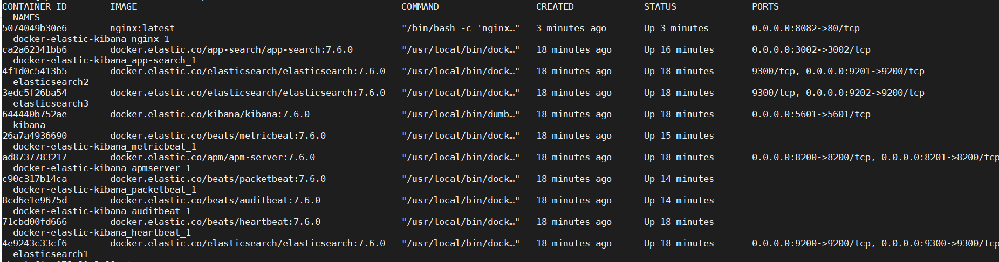
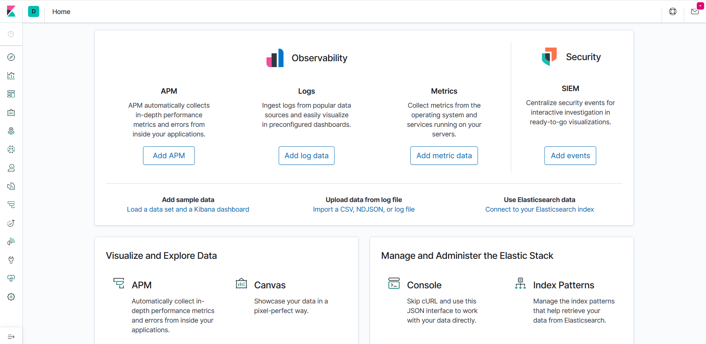
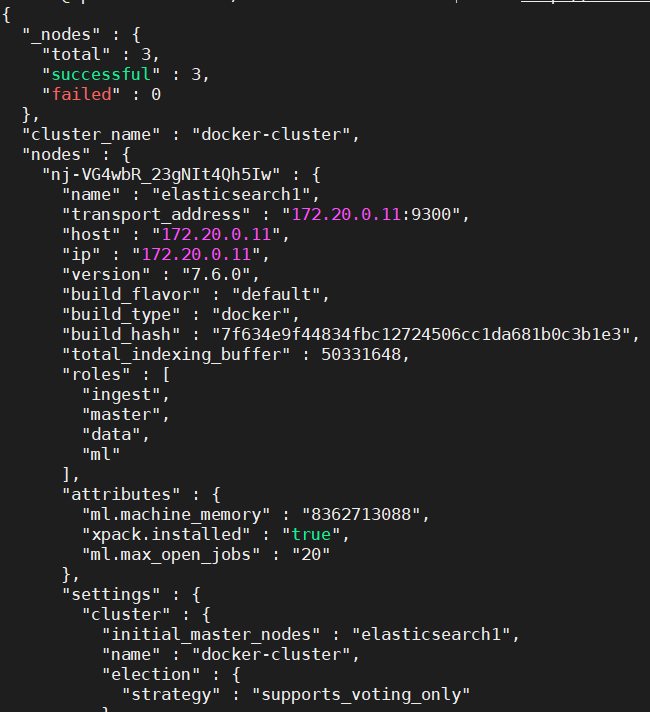
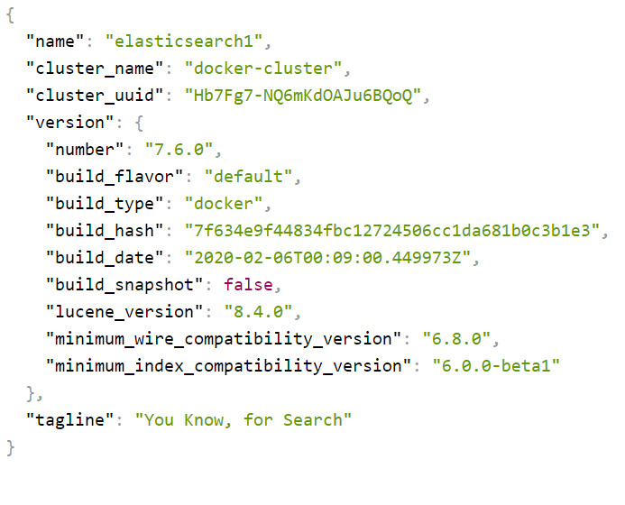
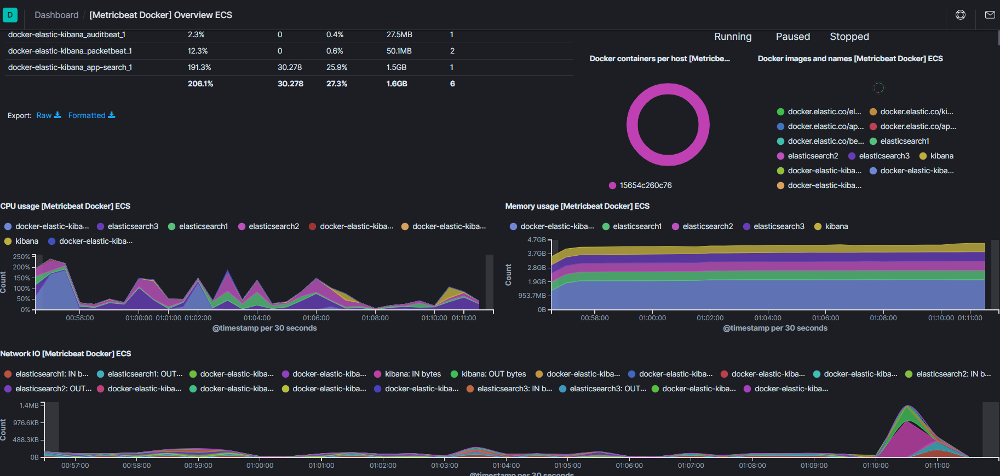
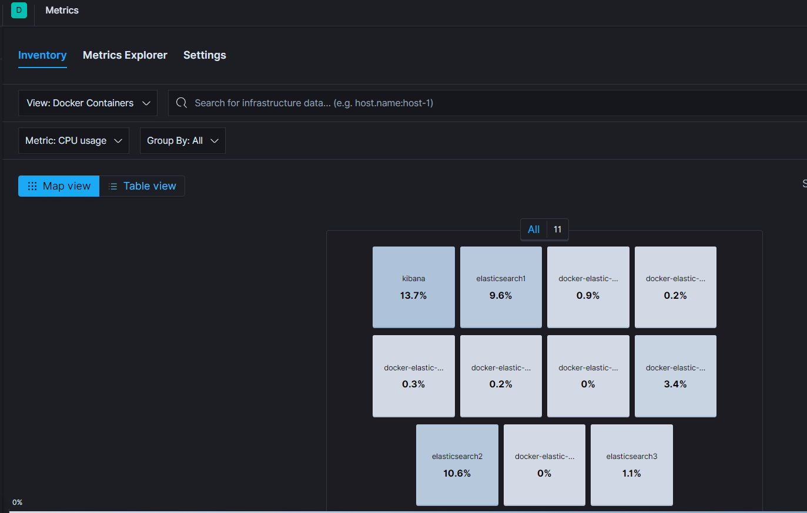
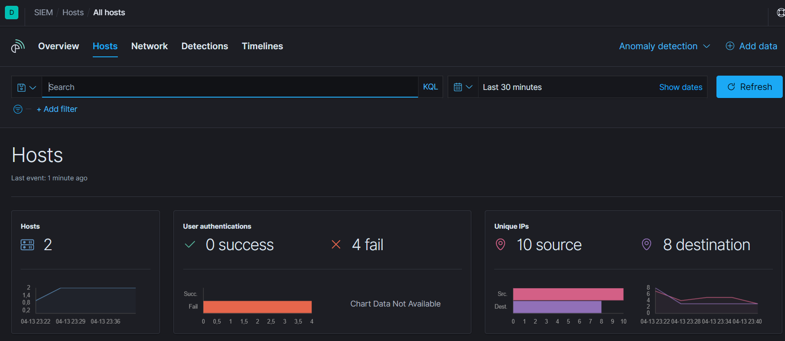
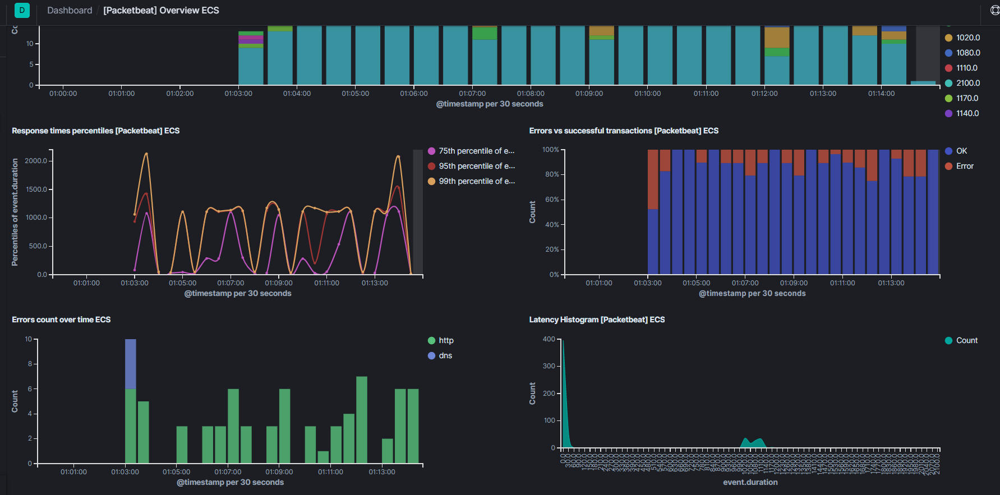
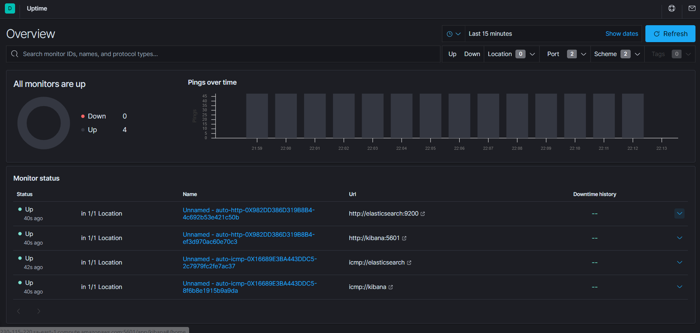

# Elastic Stack on Docker
* **Criado por:** Leandro de Matos Pereira<br>
* **Última atualização:** 14.04.2020

Nesse repositório estão dispostos os arquivos necessários para configuração do ambiente, lembrando que utilizei esse ambiente usando um EC2 da AWS, no entanto é possível replicar em qualquer um dos Cloud Providers ou até mesmo por meio do VirtualBox utilizando o Vagrant para provisionar as máquinas.

Nesse tutorial, a instalação é feita usando o Docker, no entanto é possível fazer a instalação individual nas máquinas apenas baixando o binário de instalação, no entanto optei pela opção via containers, o que deixa o processo muito mais rápido.

### Configuração do servidor:

A criação de uma máquina com a seguinte configuração é mais que suficiente para testes no ambiente. Uma máquina Linux com 2VCPU, 08GB de RAM e 20GB de disco, equivalente ao tipo t2.large, caso não seja possível, pode utilizar a t2.medium

### Overview do ambiente criado:

*	3 Node Elasticsearch para a formação do Cluster 7.6.0
*	Kibana version 7.6.0
*	Audit Beat version 7.6.0
*	MetricBeat version 7.6.0
*	HeartBeat version 7.6.0
*	PacketBeat version 7.6.0
*	APM Server version 7.6.0
*	APM Search 7.6.0
*	NGINX 7.6.0

### Instalando e configurando os recursos do SO:

Aumentar a memória Virtual, conforme a documentação oficial da Elastic: https://www.elastic.co/guide/en/elasticsearch/reference/current/vm-max-map-count.html

```
sudo sysctl -w vm.max_map_count=262144 
```
A recomedação é editar o arquivo de configuração /etc/sysctl.conf, incluindo os paramêtros de forma permanente. Assim mesmo que ocorra o reboot do SO, esta configuração é mantida.


Instalação do Docker, conforme a documentação oficial: https://github.com/docker/docker-install

```
curl -fsSL https://get.docker.com | sh
```

Instalação do Docker-Compose, conforme a documentação oficial da Docker: https://docs.docker.com/compose/install/

```
sudo curl -L "https://github.com/docker/compose/releases/download/1.25.3/docker-compose-$(uname -s)-$(uname -m)" -o /usr/local/bin/docker-compose
sudo chmod +x /usr/local/bin/docker-compose
sudo ln -s /usr/local/bin/docker-compose /usr/bin/docker-compose

```

Com tudo instalado validamos o docker e o docker-compose:

```
docker -v
docker-compose -version
```

### Baixando esse repositório via Git:
Para baixar o repositorio com o compose digite o comando abaixo. Pode ocorrer uma demora de alguns minutos para baixar as imagens e subir todos os contâiners.

```
git clone https://github.com/leandro-matos/docker-elastic-kibana.git
```
Entre dentro do diretório baixado:
```
cd docker-elastic-kibana
```

### Como fazer a execução.
Com o docker e o docker-compose instalados (no meu caso num Linux) basta baixar esse conteudo via ```git clone``` e entrando na pasta baixada rodar o comando abaixo:

```
sudo docker-compose up -d
```

### Como parar a execução.
Para remover os containers, assim como as respectivas configurações, basta executar o comando abaixo:

```
sudo docker-compose down -d
```
  
### Monitorando o start dos serviços:
Podemos acompanhar os logs de inicialização de cada serviço com o comando abaixo:
```
sudo docker-compose logs -f
```

### Checando o status dos containers
```
docker-compose ps -a
```


### Acesso ao Kibana
```
http://seuhost:5601
```

### Validando se o Kibana está rodando


### Acessando o Kibana pelo Nginx
```
http://seuhost:8081
```

### Acessando o ElasticSearch
```
http://seuhost:9200
```
### Validando se o ElasticSearch está rodando

#### Via comando
```
curl http://localhost:9200/_nodes?pretty=true
```


#### Via Web



### Dashboards

Exemplo de Dashboards criados automaticamente pelos Beats, o arquivo de configuração está dentro da pasta /config. 

Vale salientar que é possível modificar tais configurações, basta consultar a documentação da elastic para mais detalhes:
https://www.elastic.co/pt/beats/

### Metricbeat:


### Metricbeat:


### Auditbeat:


### Packetbeat:


### Heartbeat:


# **Links Úteis**
* [Documentação Oficial](https://www.elastic.co/guide/en/elasticsearch/reference/current/index.html)
* [Treinamentos Elastic](https://training.elastic.co/)
* [Open Distro Elasticsearch](https://medium.com/@maxy_ermayank/tl-dr-aws-open-distro-elasticsearch-fc642f0e592a)
